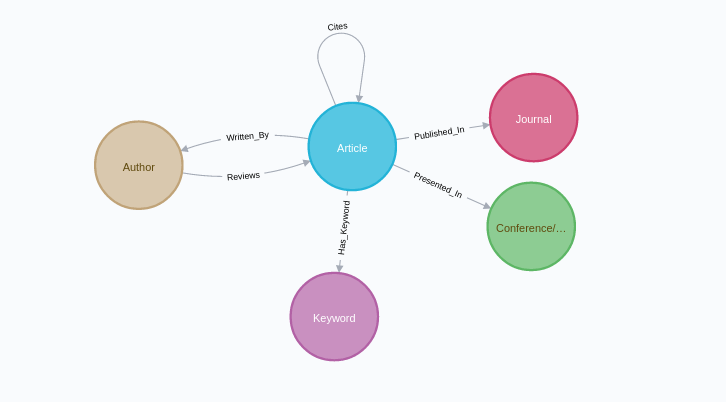
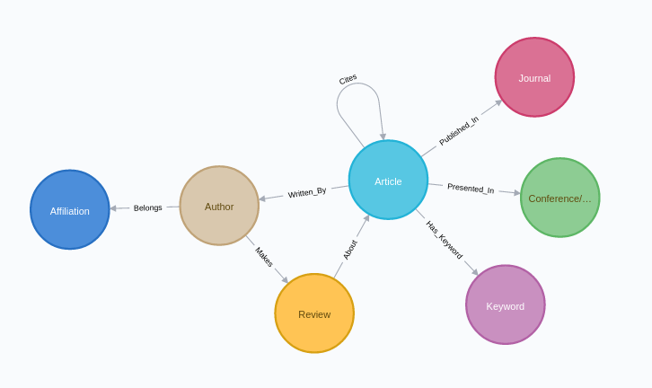

# SDM-property_graphs
Repository for SDM Lab 1

test.py, helloworld.py and a2_instantiating.py contain just some code to try the python neo4j driver functionalities.

### A. Modeling, Loading, Evolving

#### A.1. Modeling
Modeling was done taking into account both the description provided and the queries that have to be done in section B.

#### A.2. Instantiating/Loading

In order to load the data in the graph database, first we needed the data. In order to obtain it, an xml file was downloaded from https://dblp.org/xml/release/, with its corresponding dtd file.

The files downloaded were:
- `dblp-2019-11-01.xml.gz` 
- `dblp-2017-08-29.dtd`

Once downloaded, we needed to generate csv files suitable to be loaded to the graph database. We made use of the script available here https://github.com/ThomHurks/dblp-to-csv

CSVs need preprocessing. Besides, information (instances) are missing for some of the nodes modelled in section A.1 (v.g.: reviewed_by, Keyword, has, cites, presented_in, Conference). Different approaches were followed for obtaining that data.
- reviewed_by --> randomly generated
- Keyword --> randomly generated
- has --> randomly generated
- cites --> randomly generated
- presented_in --> part of if obtained from `output_proceedings.csv`, part randomly generated
- Conference --> obtained from `output_proceedings.csv`

Once having the csvs, the bash script populate.sh will be used to load the data in the database.

The data for one of the relationships had to be updated. For it, the cql queries available in `update_presented_in_relationship.cql` were used.

#### A.3. Evolving the graph

In order to evolve the graph with the requirements provided, a new node "Review" was created, containing two properties (content and decision). After it, two relationships were created; "Creates" and "About".

Besides, in order to model the affiliation of the authors, a new node "Affiliation" was created, as well as the relationship between the Affiliations and the Authors.

The code developed in order to create the new csvs is available in `generate_csvs_evolving_graph.ipynb` and `generate_affiliation_and_belongs.ipynb`

The resulting schema after evolving it can be seen in the image below.
